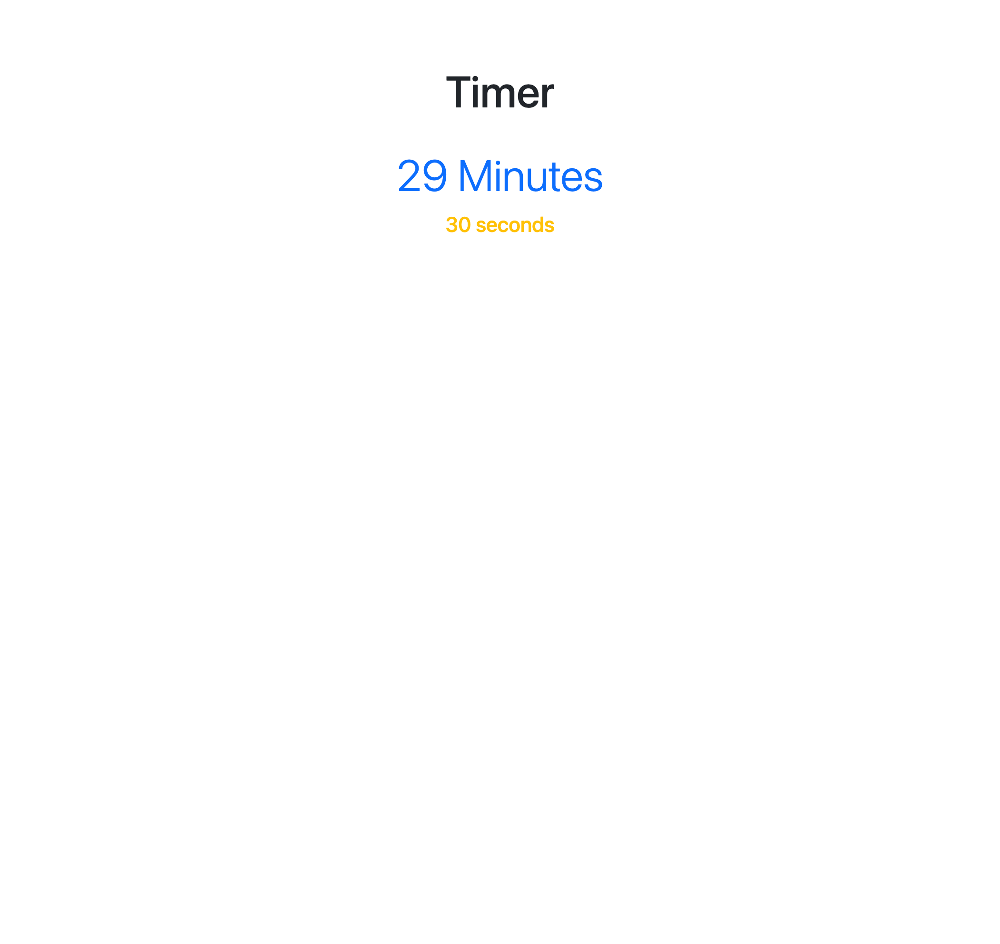
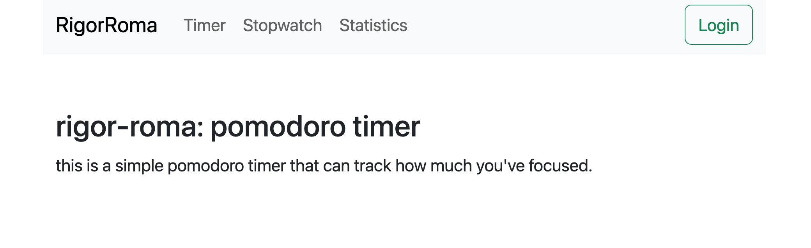
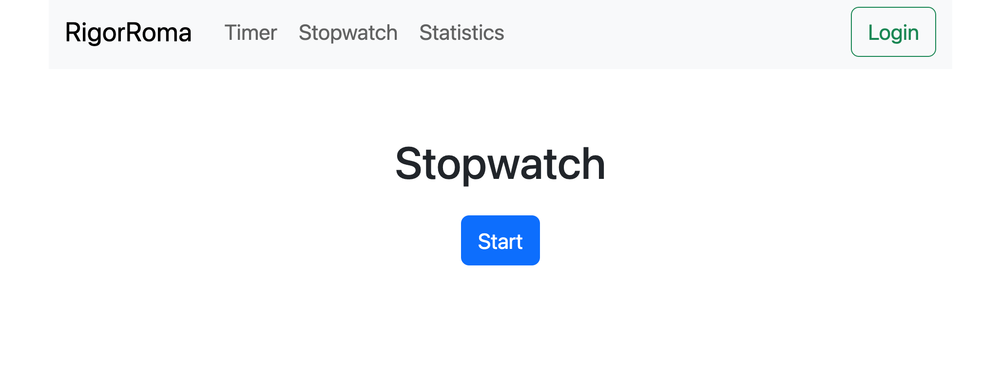

# RigorRoma: Pomodoro Web App Timer

RigorRoma is a full-stack Pomodoro timer web application designed to help you stay focused and track your study sessions. This project leverages modern web technologies to offer a smooth user experience with visual feedback, session tracking, and user authentication.

---

## Project Structure
```
project-root/
├── backend/
│   ├── src/
│   │   ├── app.ts               # Express app setup, MongoDB connection, and middleware
│   │   ├── index.ts             # Server startup script
│   │   ├── types.ts             # TypeScript types for the backend
│   │   ├── routes/
│   │   │   ├── loginRouter.ts   # Handles user authentication (login)
│   │   │   └── userRouter.ts    # Handles user creation and focus session updates
│   │   ├── models/
│   │   │   └── userModel.ts     # Mongoose schema for User
│   │   └── utils/
│   │       ├── errorHandler.ts  # Global error handler
│   │       └── userExtractor.ts # Middleware for extracting user data from JWT tokens
│   └── .env                     # Environment variables (MONGODB_URI, PORT, SECRET)
│
├── frontend/
│   ├── src/
│   │   ├── App.tsx              # Main React component; sets up routing and layout
│   │   ├── main.tsx             # Entry point; renders the app and wraps with Redux, Router, NextUI
│   │   ├── index.css            # Global styles (using TailwindCSS)
│   │   ├── store.ts             # Redux store configuration
│   │   ├── types.ts             # TypeScript types for the frontend
│   │   ├── Print.js             # Debugging utility
│   │   ├── Services/
│   │   │   ├── loginService.ts  # Service for handling login requests
│   │   │   └── userService.ts   # Service for handling user and focus session API calls
│   │   ├── Components/
│   │   │   ├── Menu.tsx         # Navigation menu with links to key pages
│   │   │   ├── Notification.tsx # Displays success/error messages using Redux state
│   │   │   └── Heatmap.tsx      # (Optional) Heatmap component using D3 to visualize data
│   │   ├── Pages/
│   │       ├── About.tsx        # About page describing the app
│   │       ├── Timer.tsx        # Pomodoro timer page; lets users set a countdown timer
│   │       ├── Stopwatch.tsx    # Stopwatch page; tracks session time and updates focus minutes
│   │       ├── Statistics.tsx   # Displays a table of recorded focus sessions
│   │       ├── Login.tsx        # Login form for user authentication
│   │       └── CreateAccount.tsx# Account creation form with validations
│   └── reducers/                # Redux slices for notifications, running state, and user data
│       ├── notificationReducer.ts
│       ├── runningReducer.ts
│       └── userReducer.ts
│
└── README.md                    # This file
```

---

## Getting Started

### 1. Clone the Repository
Clone the project to your local machine:
```bash
git clone https://github.com/your-repo/rigorroma.git
cd rigorroma
```

### 2. Setup and Run the Backend

1. **Install Dependencies**
   ```bash
   cd backend
   npm install
   ```

2. **Configure Environment Variables**
   Create a `.env` file in the `backend/` directory with the following contents:
   ```env
   MONGODB_URI=mongodb://localhost:27017/pomodoro
   PORT=3001
   SECRET=your-jwt-secret
   ```
   Replace `your-jwt-secret` with a secure key of your choice.

3. **Start the Backend Server**
   ```bash
   npm run dev
   ```
   The backend server will connect to MongoDB and listen on port 3001 (or your specified port).

### 3. Setup and Run the Frontend

1. **Install Dependencies**
   ```bash
   cd ../frontend
   npm install
   ```

2. **Start the Frontend Application**
   ```bash
   npm run dev
   ```
   The React app will launch and use the Redux store along with NextUI and React Router.

---

## 🌐 Backend Overview

- **app.ts**: Initializes the Express app, configures middleware (JSON parsing, static file serving), connects to MongoDB, and sets up routes.
- **loginRouter.ts**: Manages user authentication; validates credentials using bcrypt and issues JWT tokens.
- **userRouter.ts**: Handles user registration and updates focus sessions using PUT requests.
- **userModel.ts**: Defines the Mongoose schema for users, including their focus sessions (rigor).
- **errorHandler.ts**: Catches and handles errors like validation errors and JWT issues.
- **userExtractor.ts**: Middleware to extract and verify JWT tokens and attach user data to incoming requests.

---

## 🎨 Frontend Overview

- **App.tsx**: The main application component that sets up routing to various pages (About, Timer, Stopwatch, Statistics, Login, Create Account).
- **main.tsx**: Renders the application and wraps it with Redux Provider, NextUIProvider, and Router.
- **Pages**:
  - **About.tsx**: Provides an introduction and description of the app.
  - **Timer.tsx**: Lets users set a countdown timer. Once the timer ends, focus minutes are recorded.
  - **Stopwatch.tsx**: Allows users to track time with a stopwatch; on stop, it records the session.
  - **Statistics.tsx**: Displays a table of focus sessions.
  - **Login.tsx** & **CreateAccount.tsx**: Handle user authentication and account creation.
- **Components**:
  - **Menu.tsx**: Navigation bar with links to various pages and a logout button.
  - **Notification.tsx**: Displays success/error messages based on Redux state.
  - **Heatmap.tsx**: Optional component for data visualization using D3.
- **Reducers**:
  - **notificationReducer.ts**: Manages notifications for actions like login, logout, and timer completion.
  - **runningReducer.ts**: Tracks whether a timer/stopwatch session is active.
  - **userReducer.ts**: Manages user state and asynchronous actions for login, user creation, and focus session updates.
- **Services**:
  - **loginService.ts** & **userService.ts**: Provide API calls for login, user registration, and updating focus sessions.

---

## ⚙️ API Endpoints

| Method | Endpoint               | Description                           |
|--------|------------------------|---------------------------------------|
| POST   | `/api/users`           | Create a new user                     |
| POST   | `/api/login`           | Authenticate user and return a JWT    |
| PUT    | `/api/users/:id/add`   | Add focus minutes to a user's record  |
| GET    | `*` (Fallback Route)   | Serves the frontend application       |

---
## Screenshots




